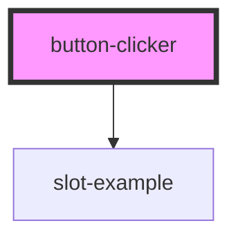

# button-clicker

<!-- Auto Generated Below -->

## Properties

| Property   | Attribute | Description | Type       | Default     |
| ---------- | --------- | ----------- | ---------- | ----------- |
| `callback` | --        |             | `Function` | `undefined` |
| `count`    | `count`   |             | `number`   | `0`         |
| `type`     | `type`    |             | `string`   | `undefined` |

## Events

| Event        | Description | Type               |
| ------------ | ----------- | ------------------ |
| `clickEvent` |             | `CustomEvent<any>` |

## Dependencies

### Depends on

- [slot-example](../example)

### Graph

----------------------------------------------

*Built with [StencilJS](https://stenciljs.com/)*
